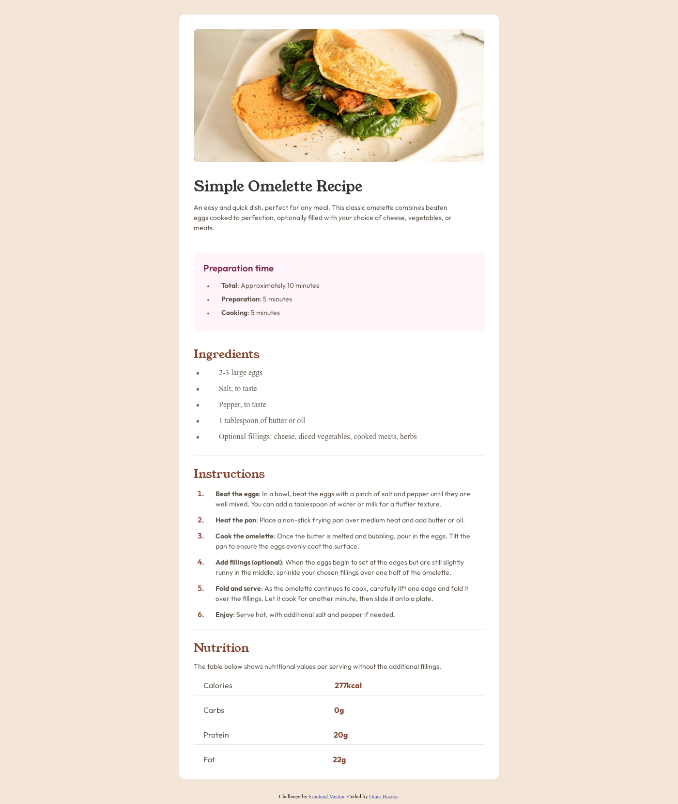

# Frontend Mentor - Recipe page solution

This is a solution to the [Recipe page challenge on Frontend Mentor](https://www.frontendmentor.io/challenges/recipe-page-KiTsR8QQKm). Frontend Mentor challenges help you improve your coding skills by building realistic projects. 

## Table of contents

- [Overview](#overview)
  - [Screenshot](#screenshot)
  - [Links](#links)
- [My process](#my-process)
  - [Built with](#built-with)
  - [What I learned](#what-i-learned)
  - [Continued development](#continued-development)
  - [Useful resources](#useful-resources)
- [Author](#author)
- [Acknowledgments](#acknowledgments)


## Overview

I created this section of the webpage as a way to practice and improve my HTML and CSS skills.
The goal was to reinforce my understanding, experiment with layout and styling techniques, and expand my front-end development knowledge through hands-on learning.

### Screenshot




### Links

- Live Site URL: https://snowmar2.github.io/Recipe-page/

## My process

I started by analyzing the provided images and the requested design.
Then, I planned the structure and began building the layout using HTML.
Once the basic structure was in place, I worked section by section, applying styles with CSS to match the design and improve visual consistency.

### Built with

- Semantic HTML5 markup
- CSS custom properties

### What I learned

How to plan and analyze a project before starting the implementation

How to research effectively and find solutions using resources like MDN

How to customize bullet points using CSS, like this:


HTML

```html
     <div class="preparation-time">
        <h3>Preparation time</h3>
        <ul class="preparation-time-list">
          <li><strong>Total</strong>: Approximately 10 minutes</li>
          <li><strong>Preparation</strong>: 5 minutes</li>
          <li><strong>Cooking</strong>: 5 minutes</li>
        </ul>
      </div>

```

CSS

```css
.preparation-time-list li {
  margin-bottom: 10px;
  padding-left: 20px;
  font-family: "Outfit", sans-serif;
  font-weight: 400;
  color: hsl(30, 10%, 34%);
  /* Space between bullet and text */
  position: relative;
  list-style: none;
  margin-left: 1.2em;
  font-size: 14px;
}

.preparation-time-list li::before {
  content: "•"; /* Custom bullet character */
  position: absolute;
  left: -10px;
  color: hsl(332, 51%, 32%); /* Bullet color */
  font-size: 1.2em; /* Bullet size */
  top: -0.03em;
}
}
```

How to write semantic HTML by using meaningful tags like <section>, <article>, <header>, and <footer> to improve structure and accessibility

How to use CSS classes effectively to organize styles and avoid repetition

Gained a clear understanding of display: inline-block and how it allows elements to flow inline while still respecting box-model styling (like width, margin, padding)

Learned the difference between position: relative and position: absolute, and how to use them together to place elements precisely on the page

Note: I didn’t use CSS Grid or Flexbox in this project, as I haven’t covered them yet in my learning journey — but I’m looking forward to exploring them soon!

### Continued development

Understanding and using different CSS units: px, em, %, rem

Customizing bullet points using ::marker and pseudo-elements

Aligning and spacing list items with nth-child and margins

### Useful resources

- MDN Web Docs helped me expand my knowledge on certain topics while creating this page..
- Claude supported me as a mentor by helping evaluate and review my code throughout the project.


## Author

- Website - [Omar Hazem](https://www.linkedin.com/in/omar-hazem-aa287a273/)
- Twitter - [@yourusername](https://x.com/OmarHaz67778375)


## Acknowledgments

I would like to acknowledge AlMadersa, where I am currently studying in the Front-End Development Diploma program.
Special thanks to my course tutor, Mohamed Abu Sarea (محمد أبو سريع), for his valuable guidance and support.
